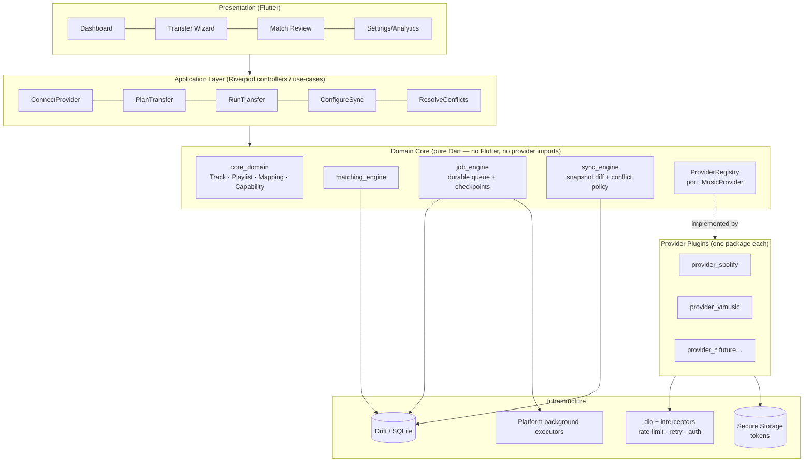
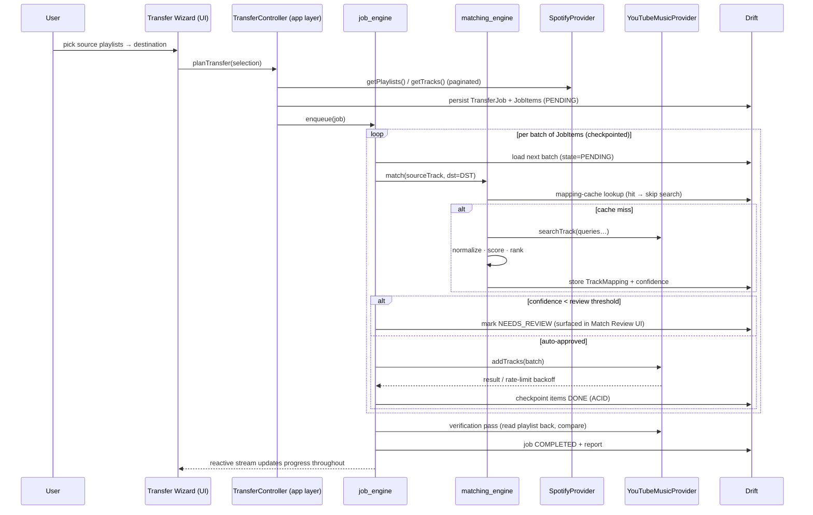

# 04 — System Architecture

## 1. Architectural Approach — options considered

| Approach | Description | Verdict |
|---|---|---|
| A. Monolithic app, per-feature folders | Fastest start; provider logic leaks everywhere | ❌ Fails the "plugins without touching core" requirement within months |
| B. **Clean/hexagonal core + provider plugins as packages** (chosen) | Pure-Dart domain core; every streaming service is an adapter package implementing one port; engines (matching/jobs/sync) are independent pure-Dart packages | ✅ Enforces the plugin rule *at the package-dependency level* — a provider package physically cannot be imported by core |
| C. Micro-kernel with dynamically loaded plugins | Runtime plugin loading (e.g. downloadable Dart AOT plugins) | ❌ Over-engineering: Dart has no sanctioned dynamic code loading on iOS anyway; compile-time plugin registry gives the same modularity without the risk |

**Chosen: B.** The dependency rule is the architecture: arrows point inward, and it is enforced by
the Dart package graph plus a CI lint (`dart_dependency_validator`) so a violation fails the build
rather than a code review.

## 2. High-Level Architecture



Rules:

1. **Core never names a provider.** Core sees only the `MusicProvider` port and `Capabilities`.
2. **Plugins never see the UI or each other.**
3. **Engines are pure Dart** — testable on the VM with zero mocks of Flutter.
4. All durable state flows through Drift; all secrets through secure storage; never crossed.

## 3. Low-Level Architecture — a transfer, end to end



Every arrow into `DB` is a durable checkpoint: kill the app anywhere in this diagram and the job
resumes from the last committed batch (docs/08 §3).

## 4. Provider Plugin Architecture

### 4.1 The port (in `provider_api`, depended on by core and by every plugin)

```dart
abstract interface class MusicProvider {
  ProviderId get id;                    // 'spotify', 'ytmusic', …
  ProviderCapabilities get capabilities;

  // -- lifecycle
  Future<AuthSession> authenticate(AuthContext ctx);   // PKCE flow
  Future<AuthSession> refreshToken(AuthSession s);
  Future<void> disconnect(AccountId account);

  // -- catalog
  Future<SearchResult> searchTrack(TrackQuery q);

  // -- library reads (all paginated via Stream/cursor)
  Stream<Playlist> getPlaylists(AccountId a);
  Stream<Track>    getLikedSongs(AccountId a);
  Stream<Album>    getAlbums(AccountId a);
  Stream<Artist>   getArtists(AccountId a);

  // -- playlist writes
  Future<Playlist> createPlaylist(AccountId a, PlaylistSpec spec);
  Future<void> updatePlaylist(PlaylistRef p, PlaylistPatch patch);
  Future<void> deletePlaylist(PlaylistRef p);
  Future<void> addTracks(PlaylistRef p, List<ProviderTrackId> ids, {int? position});
  Future<void> removeTracks(PlaylistRef p, List<ProviderTrackId> ids);
  Future<void> replaceTracks(PlaylistRef p, List<ProviderTrackId> ids);
  Future<void> uploadArtwork(PlaylistRef p, ArtworkBytes art);
  Future<void> updateDescription(PlaylistRef p, String description);
}
```

Design notes:

- **Streams for reads** — pagination is the provider's problem; core consumes a uniform stream and
  can checkpoint per page.
- **Typed errors** — every method throws only `ProviderException` subtypes
  (`RateLimited(retryAfter)`, `AuthExpired`, `NotFound`, `CapabilityUnsupported`,
  `ProviderUnavailable`), so the job engine's retry policy is provider-agnostic (docs/09 §2).
- **Calling an unsupported method** throws `CapabilityUnsupported` — but the UI should never let
  it happen, because…

### 4.2 Registration

```dart
// Compile-time registry — adding a provider is one line in the app shell,
// zero lines in core:
final providerRegistry = ProviderRegistry([
  SpotifyProvider(http, secrets),
  YouTubeMusicProvider(http, secrets),
]);
```

A new provider = new package + one registry line + its own OAuth config. CI's dependency lint
guarantees nothing else changed.

## 5. Capability System

### 5.1 Model

```dart
enum Capability {
  likedSongs, savedAlbums, followedArtists,
  playlistArtworkUpload, playlistDescription, playlistPrivacy,
  playlistReorder, collaborativePlaylists, folders,
  listeningHistory, queue, podcasts, smartPlaylists,
  isrcLookup, isrcSearch, catalogSearch,
}

class ProviderCapabilities {
  final Set<Capability> supported;
  final Map<Capability, CapabilityDetail> details; // limits & caveats, e.g.
  // artwork: maxBytes 256k jpegOnly · privacy: {public, unlisted, private}
}
```

Capabilities are **dynamic, not constant**: `YouTubeMusicProvider.capabilities` shrinks when the
session path is disabled (docs/01 §3.2) or a remote kill-switch flips. They are also **pairwise
resolved** for a transfer: `TransferPlan.effectiveCapabilities = source.read ∩ destination.write`,
computed by core, never by UI guesswork.

### 5.2 UI adaptation rule

The UI renders from `effectiveCapabilities` exclusively — features it doesn't find, it doesn't
draw (no greyed-out graveyard; unavailable-with-reason appears only in the transfer summary, e.g.
"Artwork can't be transferred: YouTube Music doesn't accept custom playlist artwork"). This is the
mechanism that makes "never hardcode functionality" true in practice, and it is tested by golden
tests per capability combination (docs/12).

## 6. Folder Structure (melos monorepo)

```
bridgetune/
├── melos.yaml                      # workspace: bootstrap, test, analyze across packages
├── apps/
│   └── bridgetune_app/             # the ONLY Flutter-app package (all 6 targets)
│       ├── lib/
│       │   ├── main.dart           # composition root: registry, DI, router
│       │   ├── features/           # UI per feature: dashboard/ transfer_wizard/
│       │   │   …                   #   match_review/ sync/ settings/ analytics/ onboarding/
│       │   ├── design_system/      # tokens, themes (dark/light/old-money), components
│       │   └── platform/           # background-executor bindings per OS, deep links
│       ├── android/ ios/ linux/ macos/ windows/ web/
│       └── test/
├── packages/
│   ├── core_domain/                # entities, value objects, capability model — pure Dart
│   ├── provider_api/               # MusicProvider port, typed errors, AuthSession
│   ├── matching_engine/            # normalizer, scorers, ranker, confidence — pure Dart
│   ├── job_engine/                 # durable queue, checkpoints, retry, scheduler — pure Dart
│   ├── sync_engine/                # snapshots, diff, conflict policies — pure Dart
│   ├── data_local/                 # Drift schema, DAOs, migrations, secure-storage facade
│   ├── provider_spotify/           # Spotify adapter + its OAuth + its rate-limit profile
│   ├── provider_ytmusic/           # YTM adapter (official + session paths behind one class)
│   └── testing_toolkit/            # fake providers, fixture catalogs, contract-test kit
├── docs/                           # this documentation set (ADRs added as adr/NNNN-*.md)
├── .github/workflows/              # CI/CD (docs/13)
└── tools/                          # codegen, fixture generators, release scripts
```

Why melos/monorepo: engines get their own test suites and dependency firewalls, yet a single PR
can update a port and its adapters atomically. `testing_toolkit`'s **provider contract-test kit**
is the enforcement mechanism for plugin correctness: every provider package must pass the same
behavioral suite against the port (docs/12 §4).
