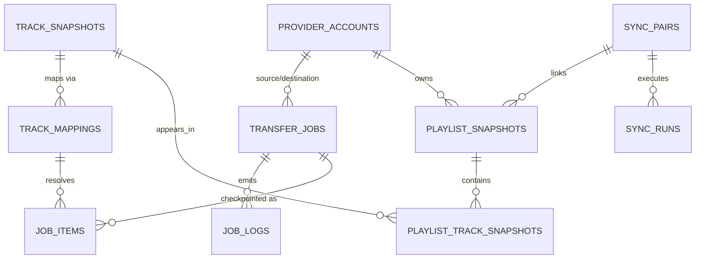

# 05 — Data Model & Database Schema (Drift / SQLite)

## 1. Storage Policy (what the local DB is — and is not)

The local database is an **operational cache and job ledger**, never the canonical music library.
The destination platform owns every playlist. Consequences:

- Playlist/track rows are **snapshots with a `fetched_at`** timestamp, refreshable and evictable.
- The only data that would genuinely hurt to lose: track **mappings** (expensive to recompute),
  **job checkpoints** (resume), and **transfer history** (user-facing record). All small.
- **Tokens are NOT in this database.** They live in platform secure storage (docs/06). The DB
  stores only non-secret account rows referencing them.

## 2. Entity-Relationship Overview



## 3. Schema (Drift table definitions, abridged to columns + constraints)

```sql
-- Connected accounts (token itself lives in secure storage under token_ref)
CREATE TABLE provider_accounts (
  id            TEXT PRIMARY KEY,             -- uuid
  provider_id   TEXT NOT NULL,                -- 'spotify' | 'ytmusic' | …
  display_name  TEXT NOT NULL,
  avatar_url    TEXT,
  token_ref     TEXT NOT NULL,                -- key into secure storage
  scopes        TEXT NOT NULL,                -- granted scopes, space-separated
  status        TEXT NOT NULL DEFAULT 'connected',  -- connected|expired|revoked
  connected_at  INTEGER NOT NULL,
  UNIQUE (provider_id, display_name)
);

-- Canonical track identity as seen at ONE provider (snapshot, evictable)
CREATE TABLE track_snapshots (
  id             TEXT PRIMARY KEY,            -- uuid
  provider_id    TEXT NOT NULL,
  provider_track_id TEXT NOT NULL,
  isrc           TEXT,                        -- nullable: YTM never has it
  title          TEXT NOT NULL,
  title_norm     TEXT NOT NULL,               -- normalized (matching engine)
  artists_json   TEXT NOT NULL,               -- ordered list
  album          TEXT,
  duration_ms    INTEGER,
  release_year   INTEGER,
  explicit       INTEGER,                     -- null = unknown
  popularity     INTEGER,
  raw_json       TEXT,                        -- provider payload for re-scoring
  fetched_at     INTEGER NOT NULL,
  UNIQUE (provider_id, provider_track_id)
);
CREATE INDEX idx_tracks_isrc ON track_snapshots (isrc) WHERE isrc IS NOT NULL;
CREATE INDEX idx_tracks_norm ON track_snapshots (title_norm);

-- The crown jewels: confirmed cross-provider track equivalences
CREATE TABLE track_mappings (
  id              TEXT PRIMARY KEY,
  src_track_id    TEXT NOT NULL REFERENCES track_snapshots(id),
  dst_provider_id TEXT NOT NULL,
  dst_provider_track_id TEXT,                 -- null = confirmed NO match exists
  confidence      REAL NOT NULL,              -- 0..1
  match_method    TEXT NOT NULL,              -- isrc|fuzzy|manual|cache
  signals_json    TEXT NOT NULL,              -- per-signal scores (explainability UI)
  decided_by      TEXT NOT NULL,              -- auto|user
  created_at      INTEGER NOT NULL,
  UNIQUE (src_track_id, dst_provider_id)
);

CREATE TABLE playlist_snapshots (
  id            TEXT PRIMARY KEY,
  account_id    TEXT NOT NULL REFERENCES provider_accounts(id) ON DELETE CASCADE,
  provider_playlist_id TEXT NOT NULL,
  name          TEXT NOT NULL,
  description   TEXT,
  privacy       TEXT,                         -- public|unlisted|private|collab
  artwork_url   TEXT,
  track_count   INTEGER NOT NULL DEFAULT 0,
  content_hash  TEXT NOT NULL,                -- ordered track-id digest → cheap change detection
  provider_etag TEXT,                         -- e.g. Spotify snapshot_id
  fetched_at    INTEGER NOT NULL,
  UNIQUE (account_id, provider_playlist_id)
);

CREATE TABLE playlist_track_snapshots (
  playlist_id   TEXT NOT NULL REFERENCES playlist_snapshots(id) ON DELETE CASCADE,
  track_id      TEXT NOT NULL REFERENCES track_snapshots(id),
  position      INTEGER NOT NULL,
  added_at      INTEGER,
  PRIMARY KEY (playlist_id, position)
);

-- Durable job ledger (docs/08)
CREATE TABLE transfer_jobs (
  id            TEXT PRIMARY KEY,
  kind          TEXT NOT NULL,   -- playlist_transfer|liked_songs|album_transfer|library_sync|retry_failed|metadata_refresh
  src_account_id TEXT NOT NULL REFERENCES provider_accounts(id),
  dst_account_id TEXT NOT NULL REFERENCES provider_accounts(id),
  spec_json     TEXT NOT NULL,   -- selection, duplicate policy, threshold, options
  state         TEXT NOT NULL,   -- queued|running|paused|needs_review|completed|failed|cancelled
  progress_done INTEGER NOT NULL DEFAULT 0,
  progress_total INTEGER NOT NULL DEFAULT 0,
  error_json    TEXT,
  created_at    INTEGER NOT NULL,
  updated_at    INTEGER NOT NULL,
  finished_at   INTEGER
);
CREATE INDEX idx_jobs_state ON transfer_jobs (state, updated_at);

-- One row per track (or album/artist) inside a job = the checkpoint unit
CREATE TABLE job_items (
  id            TEXT PRIMARY KEY,
  job_id        TEXT NOT NULL REFERENCES transfer_jobs(id) ON DELETE CASCADE,
  seq           INTEGER NOT NULL,             -- preserves playlist order
  src_track_id  TEXT NOT NULL REFERENCES track_snapshots(id),
  mapping_id    TEXT REFERENCES track_mappings(id),
  state         TEXT NOT NULL,                -- pending|matched|needs_review|transferred|verified|failed|skipped
  attempt_count INTEGER NOT NULL DEFAULT 0,
  next_retry_at INTEGER,
  last_error    TEXT,
  UNIQUE (job_id, seq)
);
CREATE INDEX idx_items_job_state ON job_items (job_id, state);
CREATE INDEX idx_items_retry ON job_items (state, next_retry_at);

-- Sync engine (docs/08 §5)
CREATE TABLE sync_pairs (
  id              TEXT PRIMARY KEY,
  src_playlist_id TEXT NOT NULL REFERENCES playlist_snapshots(id),
  dst_playlist_id TEXT NOT NULL REFERENCES playlist_snapshots(id),
  mode            TEXT NOT NULL,   -- one_way|two_way
  conflict_policy TEXT NOT NULL,   -- mirror_source|merge|keep_both|manual
  schedule_cron   TEXT,            -- null = manual only
  enabled         INTEGER NOT NULL DEFAULT 1,
  last_synced_at  INTEGER,
  base_state_json TEXT             -- last agreed state → 3-way diff anchor
);

CREATE TABLE sync_runs (
  id           TEXT PRIMARY KEY,
  pair_id      TEXT NOT NULL REFERENCES sync_pairs(id) ON DELETE CASCADE,
  trigger      TEXT NOT NULL,      -- manual|scheduled|change_detected
  state        TEXT NOT NULL,      -- running|completed|failed|conflicts_pending
  diff_json    TEXT,               -- adds/removes/moves decided this run
  started_at   INTEGER NOT NULL,
  finished_at  INTEGER
);

-- Observability (ring-buffered; docs/09)
CREATE TABLE job_logs (
  id         INTEGER PRIMARY KEY AUTOINCREMENT,
  job_id     TEXT,
  level      TEXT NOT NULL,        -- debug|info|warn|error
  event      TEXT NOT NULL,        -- machine-readable code, e.g. RATE_LIMITED
  detail_json TEXT,
  at         INTEGER NOT NULL
);

CREATE TABLE app_settings (        -- theme, thresholds, duplicate policy, locale…
  key TEXT PRIMARY KEY, value_json TEXT NOT NULL, updated_at INTEGER NOT NULL
);
```

## 4. Design Decisions Worth Defending

1. **`job_items` is the atom of durability.** A batch commit = one transaction flipping N item
   states + the job's progress counters. Crash-consistency falls out of SQLite ACID; "resume" is
   just `WHERE state IN ('pending','failed') AND (next_retry_at IS NULL OR next_retry_at < now)`.
2. **Mappings are provider-pair-scoped, not job-scoped** — so a second playlist containing the
   same song never re-searches. `dst_provider_track_id NULL` memoizes *confirmed misses* too
   (with re-check TTL), which saves the most expensive quota (YTM search).
3. **`signals_json` keeps per-signal scores** so the Match Review UI can *explain* a match, and so
   re-ranking after algorithm improvements can re-score without re-fetching candidates
   (`raw_json` on `track_snapshots` serves the same purpose).
4. **`content_hash` + `provider_etag`** make change detection an O(1) comparison per playlist,
   the enabler for cheap incremental sync (docs/08 §5).
5. **Retention:** `job_logs` ring-buffered (config, default 14 days); snapshots evicted LRU beyond
   a size budget; `track_mappings` and `transfer_jobs` history kept until user deletes (GDPR wipe
   deletes everything, docs/06 §6).
6. **Migrations** via Drift's versioned migrator; every schema change ships with an
   up-migration test against a fixture DB of the previous version (docs/12).
