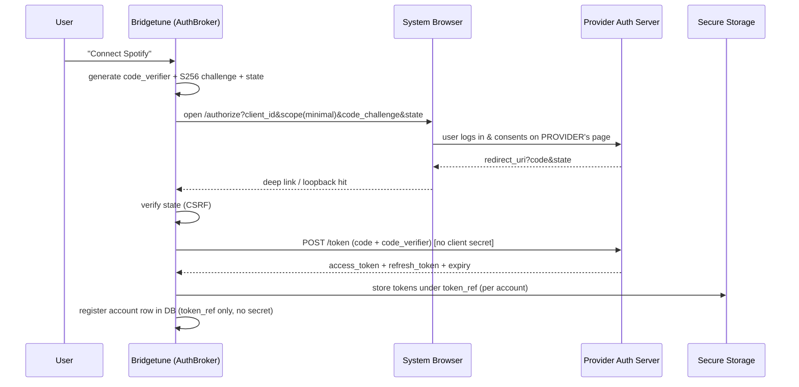

# 06 — Authentication & Security Architecture

## 1. Authentication Requirements Recap

Multiple simultaneously connected accounts, OAuth 2.0 with PKCE, secure token custody on six
platforms, refresh, logout/reconnect, least-privilege scopes, and **no secrets shipped in the
binary or exposed anywhere**.

## 2. OAuth Design — public client + PKCE everywhere

All MVP providers support the **public client + PKCE** model, which means the app holds **no
client secret at all** — the largest possible attack surface simply doesn't exist. Redirect
handling differs by platform and is abstracted behind one `AuthBroker` interface:

| Platform | Redirect mechanism |
|---|---|
| Android / iOS | Custom scheme + App Links/Universal Links via `flutter_appauth` (system browser, never WebView) |
| Windows / macOS / Linux | Loopback redirect (`http://127.0.0.1:{random_port}/callback`) per RFC 8252 |
| Web | Standard authorization-code + PKCE redirect to app route |

### Authentication flow

### Token lifecycle

- **Proactive refresh:** a dio interceptor refreshes when `expires_at - now < 2 min`; on a 401 it
  refreshes once and replays the request; concurrent refreshes are single-flighted per account.
- **Refresh-token rotation** (Spotify rotates): new refresh token replaces old atomically in
  secure storage; a failed rotation marks the account `expired` and surfaces a non-blocking
  "Reconnect" chip in the UI — jobs touching that account pause rather than fail (docs/08).
- **Logout / disconnect:** revoke at the provider where an endpoint exists, delete tokens from
  secure storage, cascade-delete the account's snapshots; mappings survive (they're not
  account-scoped).
- **Least privilege:** scopes requested per feature actually used, e.g. Spotify
  `playlist-read-private playlist-modify-private playlist-modify-public user-library-read
  user-library-modify user-follow-read user-follow-modify` — and read-only scopes only, if the
  user connects a source-only account (wizard asks direction first).
- **Multiple accounts:** `provider_accounts` is keyed by (provider, account); every engine API
  takes an `AccountId` — there is no "current account" global.

### YTM session path (the consented unofficial path, docs/01 §3.2)

Treated as a credential with the same custody as OAuth tokens: stored in secure storage, never
logged, never leaves the device, revocable in Settings, gated behind versioned informed consent.

## 3. Token & Secret Custody per Platform

| Platform | Mechanism |
|---|---|
| Android | Keystore-backed EncryptedSharedPreferences (flutter_secure_storage) |
| iOS / macOS | Keychain (`kSecAttrAccessibleAfterFirstUnlockThisDeviceOnly` so background jobs can run) |
| Windows | DPAPI (user scope) |
| Linux | Secret Service (libsecret); fallback to AES-GCM file keyed by a machine-derived key with explicit UX warning |
| Web | **Weakest link, by design decision:** tokens in memory + IndexedDB sealed with AES-GCM via WebCrypto non-extractable keys; sessions are shorter-lived; the consented YTM session path is **desktop/mobile-only** (never stored in a browser) |

## 4. Security Architecture (threat-model driven)

| Threat | Control |
|---|---|
| Token theft from device backup/filesystem | Hardware-backed secure storage (above); tokens never written to the SQLite DB or logs |
| Interception (MITM) | TLS 1.2+ enforced; **certificate pinning deliberately NOT applied to provider APIs** (Google/Spotify rotate certs; pinning breaks the app in the field) — pinning reserved for our own future backend, where we control rotation |
| Authorization-code interception | PKCE (S256) + `state` + loopback binding to ephemeral port |
| Secrets in binary | No client secrets exist (public clients). API client IDs are not secrets. CI secret-scanning (gitleaks) gates every PR |
| Log leakage | Structured logger with a **redaction layer**: token/authorization/set-cookie fields are stripped at the sink, not by caller discipline; log export runs the same redactor again |
| Malicious deep link / redirect spoof | `state` verification, exact redirect-URI matching, single-use codes |
| SQL injection | Drift parameterized queries only; no string SQL from user input |
| Supply chain | Dependency pinning via lockfiles; `dart pub audit` + Dependabot in CI; melos-enforced package boundaries limit blast radius |
| Remote provider incident | Per-provider kill switch (docs/02 §2.2) |

## 5. Rate-Limit Handling as a security/compliance concern

Per-provider **rate governor** in the dio interceptor stack: token-bucket tuned to each provider's
published limits, honors `Retry-After` on 429 with jittered exponential backoff, and adaptively
halves throughput on repeated 429s. This is what keeps us inside ToS "no quota circumvention"
clauses — we *under*-consume, never evade (full policy in docs/09 §2).

## 6. Privacy / GDPR by Design

- **Data inventory is tiny by construction:** provider display name + avatar, library metadata
  snapshots, mappings, jobs, logs. No email, no real name, no payment data in MVP.
- **Local-first:** in the MVP nothing leaves the device except calls to the providers themselves.
  Optional crash reporting (Sentry) is **opt-in**, with PII scrubbing on.
- **Right to erasure = Settings → Delete Everything:** wipes DB, secure storage, caches; provider
  revocation calls where supported. Because there's no server, erasure is genuinely complete.
- **Data portability = Settings → Export:** transfer history and logs export as JSON/CSV.
- **Consent ledger:** the YTM-session informed consent is stored versioned (text hash + timestamp)
  so changed terms re-prompt.
- When the optional backend arrives (Phase 9), it gets its own DPIA; design intent is stateless
  token brokering + job orchestration with end-to-end-encrypted state blobs.
