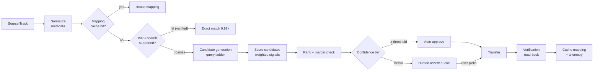

# 07 — Song Matching Engine Design

The matching engine is Bridgetune's core IP. It is a **pure-Dart package with zero provider or
Flutter dependencies**: input = a normalized source track + a candidate-search callback; output =
ranked candidates with explainable confidence. That purity makes it exhaustively unit-testable
against fixture catalogs (docs/12 §3).

## 1. Pipeline

## 2. Normalization (applied to both source and candidates)

Order matters; each step is a pure function with table-driven rules:

1. **Unicode**: NFKC fold, case fold, strip diacritics (keep a diacritic-preserved copy — "Björk"
   vs "Bjork" is a *positive* signal when it survives).
2. **Noise stripping** (title): parenthetical/bracket qualifiers matched against a curated pattern
   table — `remaster(ed)( \d{4})?`, `deluxe`, `bonus track`, `radio edit`, `mono|stereo`,
   `feat\.?|ft\.?|featuring …` — stripped **but recorded as variant flags**, not discarded:
   `{isLive, isRemaster, isAcoustic, isInstrumental, isRemix, isKaraoke/cover-suspect, featured:[…]}`.
3. **Artist processing**: split on `,|&|x|×|feat`, preserve order, primary = first; alias table
   (curated + learned from confirmed mappings): "Beyoncé/Beyonce", "P!nk/Pink", romanized ↔ native
   script pairs (BTS/방탄소년단), "The Beatles/Beatles".
4. **Album**: strip edition qualifiers (`(Deluxe)`, `(Expanded Edition)`, `[Remastered]`) with the
   same flag-recording approach.
5. **Language/regional variants**: transliteration comparison (ICU) as a *secondary* title signal
   so "Tum Hi Ho" matches its Devanagari listing on JioSaavn later.

## 3. Candidate Generation — the query ladder

Stop at the first rung yielding a confident result; every rung costs quota, so the ladder is also
the cost-control mechanism (critical for YTM's expensive search):

1. `ISRC` filter search (providers with `isrcSearch`) → verified by comparing returned ISRC.
2. `"title" artist:"primary artist" album:"album"` (fielded, where supported)
3. `"title" "primary artist"` quoted
4. `title primary_artist` plain (normalized)
5. `title-without-qualifiers primary_artist`
6. Last resort: `title` alone, top-10 candidates, scoring must carry the decision.

Each rung contributes candidates to a dedup'd pool (max ~25) before scoring.

## 4. Scoring — weighted signal fusion

Per candidate, per signal, a score in [0,1]:

| Signal | Method | Weight (fuzzy path) |
|---|---|---|
| Title similarity | max(Jaro-Winkler, token-set cosine over normalized tokens) | 0.30 |
| Artist similarity | best-alignment across artist sets, alias-aware; primary-artist match weighted double | 0.25 |
| Duration | 1.0 if Δ≤2 s; linear decay to 0 at Δ=15 s (strongest *disqualifier*: Δ>15 s caps total at 0.70) | 0.15 |
| Album similarity | Jaro-Winkler on normalized album; soft signal (compilations differ legitimately) | 0.10 |
| **Variant-flag agreement** | exact-match vector of {live, remaster, acoustic, instrumental, remix, karaoke}; a *mismatch on live/instrumental/karaoke multiplies total by 0.5* — the classic wrong-match killer | 0.10 |
| Release year | 1.0 if equal; decay over ±3 y; ignored when either unknown | 0.05 |
| Explicit flag | agreement bonus / clean-vs-explicit mild penalty (never a hard block: catalogs mislabel) | 0.03 |
| Popularity prior | tiny tiebreaker between near-identical scores only | 0.02 |

ISRC path: a verified ISRC equality short-circuits to **0.99** (not 1.0 — ISRC collisions across
remasters exist); title sanity check must still pass ≥0.5 to catch provider data errors.

**Margin rule:** top candidate must beat the runner-up by ≥0.05, otherwise the tier drops one
level (ambiguity is treated as uncertainty — this single rule prevents most confident-but-wrong
outcomes for songs with covers/re-recordings, e.g. Taylor's Versions).

## 5. Confidence Tiers & Actions

| Score | Tier | Default action |
|---|---|---|
| 0.99–1.00 | Exact | Auto-transfer |
| 0.95–0.98 | Very high | Auto-transfer |
| 0.85–0.94 | High | Auto-transfer, flagged in report |
| 0.70–0.84 | Possible | Auto-transfer **only if** user set threshold to "relaxed"; else review queue |
| < 0.70 | Uncertain | Always human review (side-by-side compare UI with per-signal explanation; options: pick candidate / search manually / skip) |

The auto-approve threshold is a user setting (strict = 0.95 / balanced = 0.85 / relaxed = 0.70),
per the Settings spec. Review decisions are written to `track_mappings` with `decided_by=user` and
**feed the alias table** — the engine learns from corrections.

## 6. Verification & Feedback Loop

After transfer, the engine re-reads the destination playlist and compares expected vs actual
(providers occasionally substitute regional equivalents). Discrepancies mark items
`failed(verification)` for retry/review. Telemetry (local): per-signal score distributions,
auto-vs-review rates, user-correction rate per provider pair — the tuning dataset for weight
adjustments, shipped as data-file updates rather than code releases.

## 7. Alternatives considered

| Alternative | Why not (now) |
|---|---|
| Audio fingerprinting (Chromaprint/AcoustID) | Requires audio access we deliberately never have; ToS and architectural non-starter |
| Third-party unified-catalog API (e.g. Odesli/Songlink) | External dependency + rate limits + cost; useful later as an *additional* candidate source rung, not a foundation |
| ML-learned ranker | Premature: no training data until we have telemetry; the weighted model is transparent and debuggable. Revisit post-MVP with accumulated correction data (the schema already stores everything needed) |
